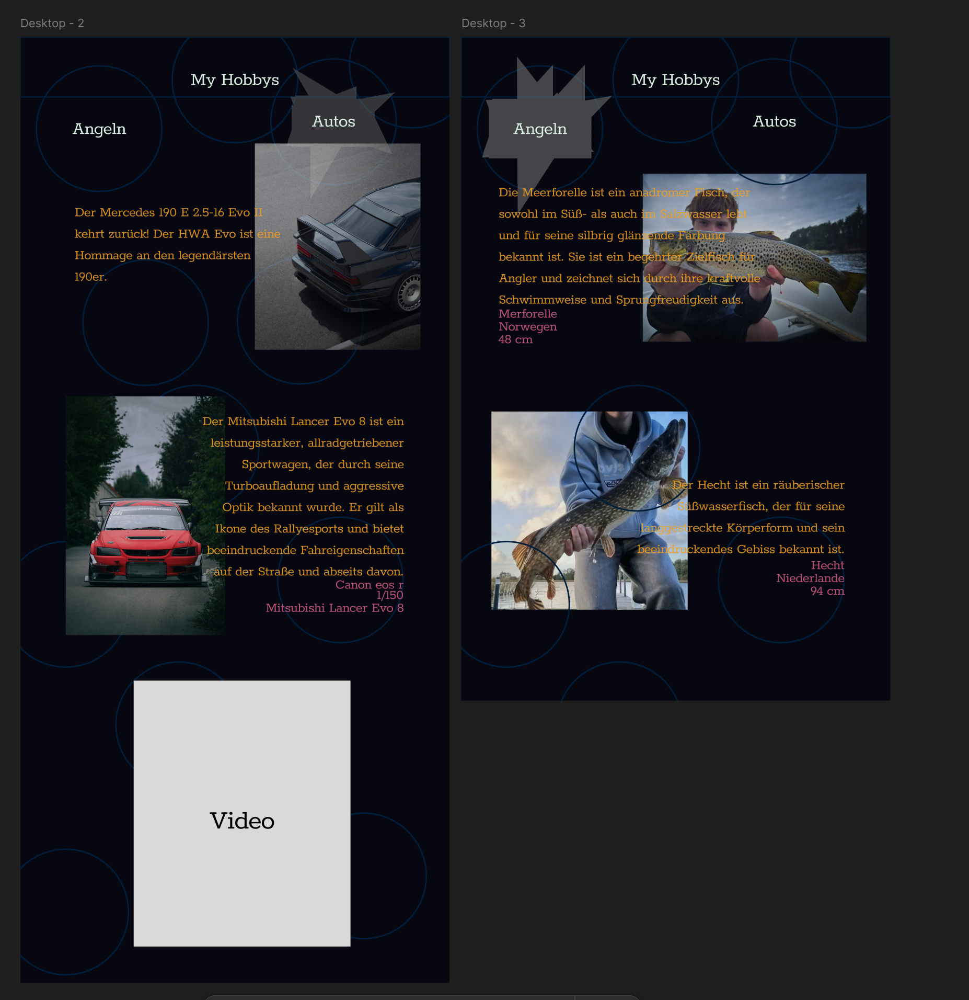

# Meine Hobbys - Webseite

Willkommen in der Dokumentation meines Projekts, in dem ich eine Webseite präsentiere, auf der ich meine Hobbys vorstelle. Dieses Projekt dient sowohl der Präsentation meiner Interessen als auch als Übung in Webdesign und -entwicklung. In dieser Datei findest du eine Einführung in das Projekt, eine Beschreibung des Designkonzepts sowie die Grundstruktur zur weiteren Dokumentation.

## Einführung

Dieses Projekt ist eine persönliche Webseite, auf der ich meine liebsten Freizeitbeschäftigungen und Hobbys vorstelle. Die Webseite ist so gestaltet, dass sie übersichtlich, benutzerfreundlich und ästhetisch ansprechend ist. Ziel ist es, den Besuchern einen Einblick in meine Interessen zu geben und gleichzeitig mein Können im Bereich Webdesign zu demonstrieren.

### Projektziele
- **Präsentation**: Meine Hobbys auf eine ansprechende Weise darzustellen.
- **Webdesign**: Eine möglichst Kreative Webseite.

## Design Konzept

##### Animationen

- Bewegende selektions Animation
- Blinkender Curser
